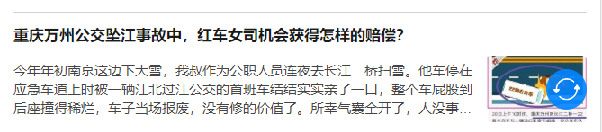

# `MintUI`-- `Unit02`

# 1.关于`Mint UI`中表单控件获取/失去焦点

```html

<mt-field type="text"
   @focus.native.capture="函数方法"
   @blur.native.capture="函数方法">
</mt-field>

```

> `native`、`stop`、`prevent`、`capture`等属于`Vue`中的事件修饰符
>
> [https://cn.vuejs.org/v2/guide/events.html#%E4%BA%8B%E4%BB%B6%E4%BF%AE%E9%A5%B0%E7%AC%A6](https://cn.vuejs.org/v2/guide/events.html#事件修饰符)

# 2.`Mint UI`组件

## · `Navbar`组件

`Navbar`组件用于实现顶部选项卡，其语法结构是：

```html

<mt-navbar v-model="变量名称" fixed>
    <mt-tab-item id="当前选项卡的ID">
        ...
    </mt-tab-item>
    ...
</mt-navbar>

```

> `navbar`绑定的变量的值应该为`mt-tab-item`中的`id`
>
> `mt-tab-item`的`id`只要在当前容器内唯一即可。
>
> 如在`<mt-tab-item>`中嵌套图像，并且为图像设置`slot="icon"`属性的话，该图像将作为选项卡的图标出现。

## · `TabContainer`组件

`TabContainer`组件用于实现面板，其语法结构是：

```html

<mt-tab-container v-model="变量名称" swipeable>
    <mt-tab-container-item  id="当前面板的ID">...</mt-tab-container-item>
    ...
</mt-tab-container>

```

> `tab-container`绑定的变量的值应该为`mt-tab-container-item`中的`id`
>
> `mt-tab-container-item`的`id`只要在当前容器内唯一即可。
>
> `swipeable`属性为布尔属性，表示面板是否具备滑动效果。

## · `Tabbar`组件

`Tabbar`组件用于实现底部选项卡，其语法结构是：

```html

<mt-tabbar v-model="变量名称" fixed>
    <mt-tab-item id="当前选项卡的ID">...</mt-tab-item>
    ...
</mt-tabbar>

```

## · 修改`Mint UI`组件样式

方式1：直接修改`Mint UI`的样式表文件 -- `mint-ui/lib/style.min.css` 或`style.css`

方式2：在某个页面组件中重新定义关于该组件样式

方式3：在重新定义组件样式时，可能会使用到 `!important`以提升权重

作业:

1.根据`Field.vue`完成学子问答项目中用户注册（`Register.vue`）及用户登录(`Login.vue`)的页面搭建

2.参考知乎的首页的页面结构，完成内容列表的搭建，结构如下图所示:

3.复习`Node.js`、`Axios`、`MySQL`,必须保证` XAMPP`可以正常启动

