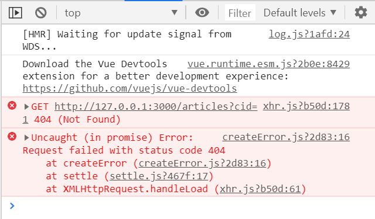
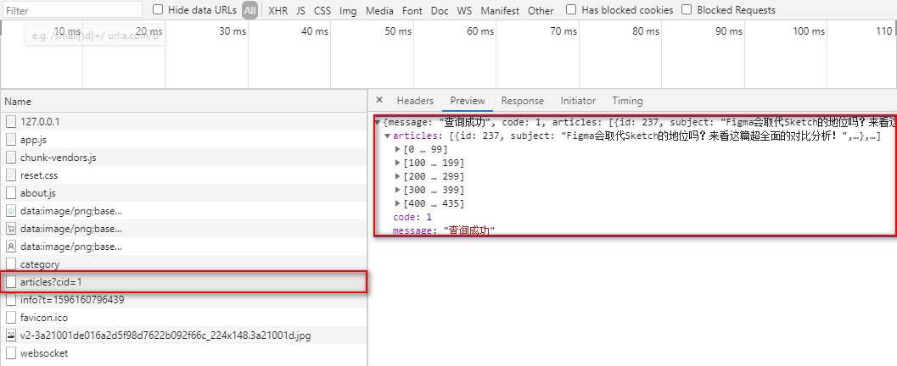
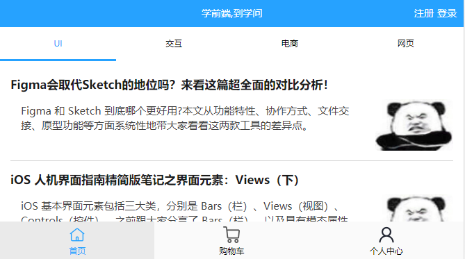
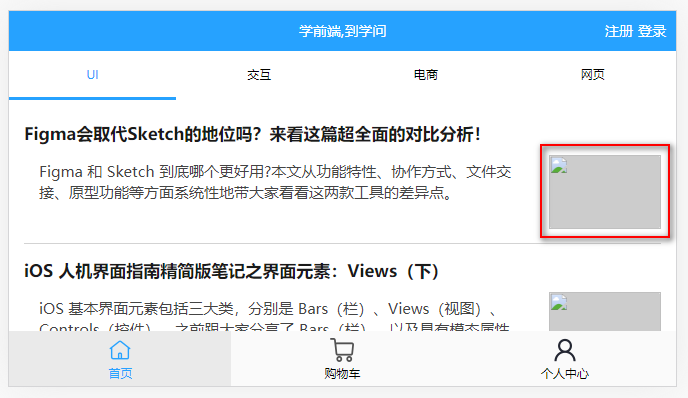
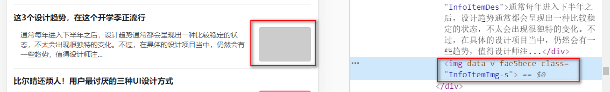
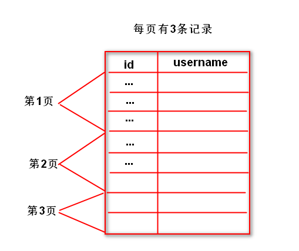
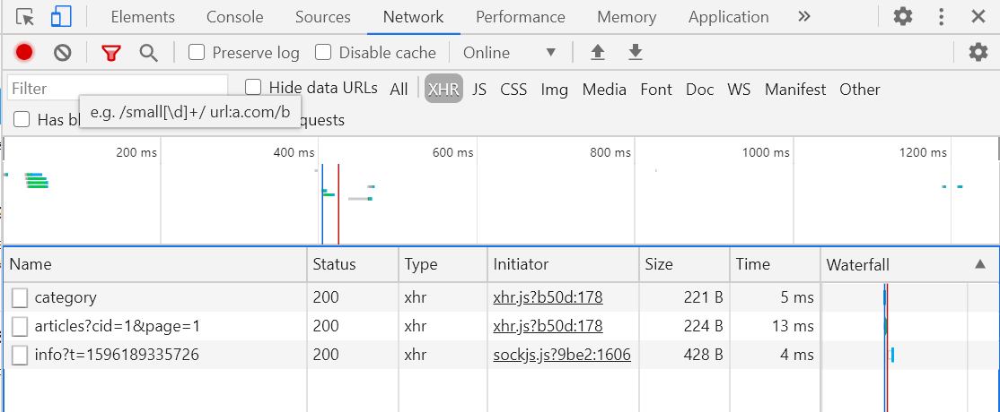

# `MintUI`-- `Unit04`

# 1.`Mint UI`组件库

## · `v-lazy`指令

`v-lazy`指令用于实现图像的懒加载，其语法结构是：

```html


```

## · `Infinite scroll`指令

`Infinite scroll`指令用于实现无限滚动，其语法结构：

```html

<HTML元素
     infinite-scroll-distance="阈值"
     v-infinite-scroll="方法名称"
     infinite-scroll-disabled="变量名称"
     infinite-scroll-immediate-check="true">
</HTML元素>


```

> `infinite-scroll-distance`属性指在滚动到距离容器底部还有多少个像素时触发无限滚动指令
>
> `v-infinite-scroll`属性指当触发无限滚动指令时需要执行的函数名称
>
> `infinite-scroll-disabled`属性指在执行滚动函数时，既使再滚动到指定范围内是否还要继续触发滚动函数。

# 2.学子问答项目实践

## 2.1 文章列表的业务实现

### · 初始化的情况

初始情况下要去服务器获取默认被选定的顶部选项卡分类所包含的文章列表，此时引申出`Vue`生命周期的钩子函数 -- `mounted`，所以`Home.vue`中的示例代码如下：

```javascript

this.axios.get('/articles?cid=' + this.active)

```

此时脚手架的运行结果如下图所示：




出现以上错误的原因是：服务器不存在指定的接口，所以：

第一步：在`Node`服务器的`app.js`中创建`/articles`的接口，请求方式为`GET`，示例代码如下：

```javascript


//获取特定分类下的文章数据
server.get('/articles',(req,res)=>{
    //获取客户端URL地址栏的参数
    let cid = req.query.cid;
    //以获取到的参数为条件在文章数据表中进行查找操作
    let sql = 'SELECT id,subject,description,image FROM xzqa_article WHERE category_id = ?';
    pool.query(sql,[cid],(err,results)=>{
        if(err) throw err;
        res.send({message:'查询成功',code:1,articles:results});
    });
});

```

完成上述代码后，要重新启动服务器！

此时脚手架的运行结果如下图所示：



此时代表服务器已经返回数据到客户端了，所以：

第二步：客户端接收服务器返回的数据，并且显示在页面组件，此时示例代码如下：

```javascript

this.axios.get('/articles?cid=' + this.active).then(res=>{
    console.log(res);
})

```

还需将返回的数据存储到`Vue`的变量中，然后再通过`v-for`指令进行循环输出，所以：

```javascript

data(){
	return {
		//存储文章数据
		articles:[]
	}
}

```

除此之外，还需要将服务器返回的数据存储到刚刚声明的变量中，示例代码如下：

```javascript

this.axios.get('/articles?cid=' + this.active).then(res=>{
    this.articles = res.data.articles;
});

```

最后通过`v-for`指令进行循环输出即可，示例代码如下：

```html

<div 
     class="InfoItem" 
     v-for="(article,index) of articles" 
     :key="index">
    <!-- 标题信息开始 -->
    <div class="InfoItemHead">{{article.subject}}</div>
    <!-- 标题信息结束 -->
    <!-- 简介与缩略图区域开始 -->
    <div class="InfoItemContent">
        <!-- 简介开始 -->
        <div class="InfoItemDes">{{article.description}}</div>
        <!-- 简介结束 -->
        <!-- 缩略图开始 -->
        
        <!-- 缩略图结束 -->
    </div>
    <!-- 简介与缩略图区域结束 -->
</div>

```

此时脚手架的运行结果如下图所示：



现在整个结构中除缩略图外，其余均是正常数据，所以：

如果此时使用`JS`中的模板字符串进行图片图出的的话，示例代码如下：

```html

 

```

但此时脚手架的运行结果是：



其根本原因是：动态图像需要通过`require`命令进行加载才可以！所以还需要重新修改原来在`mounted`钩子函数中的相关代码才行：

```javascript


this.axios.get('/articles?cid=' + this.active).then(res=>{        
    //将服务器返回的文章数据存储到articles变量中
    let data = res.data.articles;
    //循环动态加载图像
    data.forEach(item=>{       
        //因为有的文章没有图像，所以无需动态加载图像了
        //故进行判断操作
        if(item.image != null)  {
            //动态加载图像，此时item中id,subject,description没有发生任何变化
            //但是图像已经成为了动态加载的图像了
            //所以现在只能依次将最新的item添加到articles变量中了  
            item.image = require('../assets/articles/' +  item.image) ;
        }
        this.articles.push(item);
    });                    
})


```

在通过`v-for`指令进行循环操作时，进行输出就可以了，示例代码如下：

```HTML


```

之所以要添加`v-if`指令的原因是：因为既使没用图片的文章也已经加载了，但是无需要页面中显示空的、灰色的矩形，所以才进行判断操作。



因为初始情况下要显示的数据多达几百条，而且绝大部分文章都带有缩略图，所以这会增大服务器的请求压力，而且客户端将长时间面对空白页面，这样客户体验变得很差，所以最好的解决方案是：对于图像采用懒加载！！！

### · 切换顶部选项卡时的情况

切换顶部选项卡时，同样要向服务器发送请求，以获取当前分类下包含的文章数据，引申出 -- 如何在程序中获知顶部选项卡发生了变化呢? -- 通过监听顶部选项卡所绑定的变量来实现，示例代码如下：

```javascript

//监听顶部选项卡的变化
active(){
    //切换顶部选项卡时,清空之前存储的文章数据
    this.articles = [] ;
    this.axios.get('/articles?cid=' + this.active).then(res=>{
        let data = res.data.articles;
        data.forEach(item=>{
            if(item.image != null){
                item.image = require('../assets/articles/' + item.image);
            }
            this.articles.push(item);
        });
    });
}

```

现在已经可以实现初始化及切换顶部选项卡时的数据变化，但是由于数据太多，无形中在浪费服务器的请求资源，所以最好的解决方案是：初始情况下只加载部分数据，然后向下滚动时再加载另外的一部分数据，实质上也就是采用分页实现。

### · 分页显示数据

其涉及到两个技术问题：无限滚动、分页技术

### · 无限滚动的实现

第一：无限滚动的指令要添加给哪个元素呢? -- 面板容器的`div`元素

第二：在滚动到距离容器底部还有多少个像素时触发滚动函数呢? -- `10`像素

第三：触发的滚动函数是谁呢? -- `loadMore`

现在要进行分页显示数据了，其分为两种情形：

第一种：在初始情况下只显示部分数据或者说只显示第一页的数据

第二种：在滚动距离容器底部还有指定距离时，再加载第二页、第三页，...的数据

### · 初始情况下显示第一页的数据

`MySQL` 的分页原理是：利用 `SELECT`语句的`LIMIT`子句，每次只返回部分结果，即形成所谓的分页！

`LIMIT`子句的语法结构是： 

```sql

SELECT ... LIMIT [offset,] row_count

```

`offset`参数指从第几条记录开始返回，其从`0`开始编号(与`id`无任何关系)

`row_count`参数指返回多少条记录

```sql

# 从0开始返回，返回5条记录
SELECT * FROM users LIMIT 5;

```
在进行分页时，`offset`参数值是不固定的，其标准的计算公式是：

```sql

(页码-1) * 每页显示的记录数

```



 


那么必须在`Home.vue`中声明一个变量用于存储当前的页码，其初始值为`1`，所以示例代码如下：

```javascript

data(){
	return {
		//表示当前页码
		page:1
	}
}

```

现在在`mounted`钩子函数中获取初始化文章数据的时候，不仅要告诉服务器：要获取哪一类的文章，还要告诉服务器 -- 要获取该分类下的第`1`页的数据才行！于是还需要发送请求时再加额外的参数，示例代码如下：

```javascript
this.axios.get('/articles?cid=' + this.active + '&page=' + this.page).then(res=>{        
    //....
});

```

> 注意：`URL`参数之间以`&`进行连接，形如：`cid=5&page=9&mid=8`

此时脚手架的运行结果如下图所示：



现在必须修改服务器的相关代码才可以  -- `/articles` `API`

此时示例代码如下：

作业：尝试通过无限滚动实现页面数据的变化。