# `MintUI`-- `Unit05`

# 1.学子问答项目实践

## 1.1 文章列表的业务实现

### · 初始情况下显示第一页的数据

`MySQL` 的分页原理是：利用 `SELECT`语句的`LIMIT`子句，每次只返回部分结果，即形成所谓的分页！

`LIMIT`子句的语法结构是： 

```sql
SELECT ... LIMIT [offset,] row_count

```

`offset`参数指从第几条记录开始返回，其从`0`开始编号(与`id`无任何关系)

`row_count`参数指返回多少条记录

```sql
# 从0开始返回，返回5条记录
SELECT * FROM users LIMIT 5;

```

在进行分页时，`offset`参数值是不固定的，其标准的计算公式是：

```sql
(页码-1) * 每页显示的记录数

```

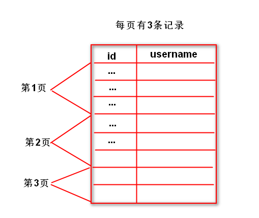

 


那么必须在`Home.vue`中声明一个变量用于存储当前的页码，其初始值为`1`，所以示例代码如下：

```javascript
data(){
	return {
		//表示当前页码
		page:1
	}
}

```

现在在`mounted`钩子函数中获取初始化文章数据的时候，不仅要告诉服务器：要获取哪一类的文章，还要告诉服务器 -- 要获取该分类下的第`1`页的数据才行！于是还需要发送请求时再加额外的参数，示例代码如下：

```javascript
this.axios.get('/articles?cid=' + this.active + '&page=' + this.page).then(res=>{        
    //....
});

```

> 注意：`URL`参数之间以`&`进行连接，形如：`cid=5&page=9&mid=8`

此时脚手架的运行结果如下图所示：

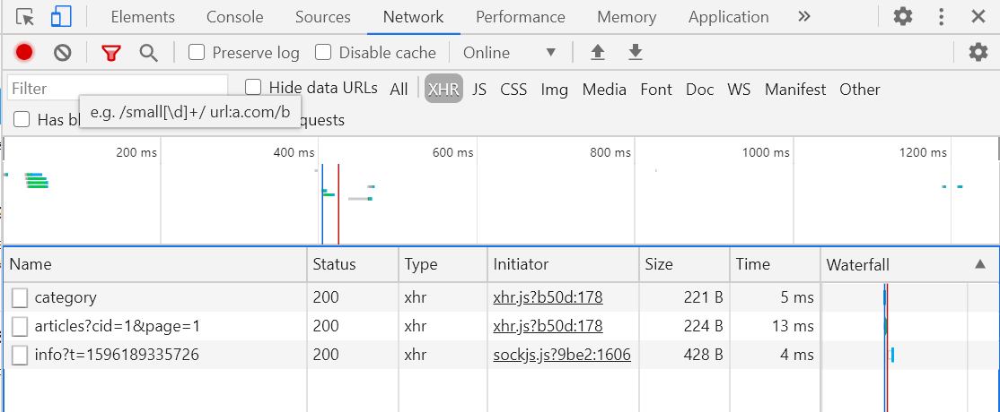

现在必须修改服务器的相关代码才可以  -- `/articles` `API`

此时示例代码如下：

```javascript

//获取特定分类下的文章数据
server.get('/articles',(req,res)=>{
    //获取客户端URL地址栏的参数
    let cid = req.query.cid;
    //获取当前的页码
    let page = req.query.page;
    //分页实质上利用了SELECT语句的LIMIT子句
    //其标准计算公式为 (页码-1) * 每页显示记录数
    //所以现在必须通过上述公式计算出 offset参数值
    let offset = (page-1) * 20;
    //以获取到的参数为条件在文章数据表中进行查找操作
    let sql = 'SELECT id,subject,description,image FROM xzqa_article WHERE category_id = ? LIMIT ' + offset + ',20';
    pool.query(sql,[cid],(err,results)=>{
        if(err) throw err;
        res.send({message:'查询成功',code:1,articles:results});
    });
});

```

这样已经实现初始化的第一页数据可正常显示了！

### ·  滚动到距离页面底部还有指定像素时再加载第二页、第三页的数据

在滚动到距离页面底部还有指定像素时，要加载第二页、第三页的数据，那么就意味着无限滚动需要与分页结合使用，而且现在的页码会在原始的基础上发生累加操作。

上节课中的无限滚动指令调用的方法名称为 -- `loadMore`，所以现在需要在该方法中：

第一：让页码发生累加操作

```javascript

loadMore(){
    //页码累加
    this.page++;
}

```

第二：将当前的页码发送到服务器以获取该指定分类下的第几页的数据，示例代码如下：

```javascript


loadMore(){
    //页码累加
    this.page++;
    //.......
    this.axios.get('/articles?cid=' + this.active + '&page=' + this.page).then(res=>{

    });
}


```

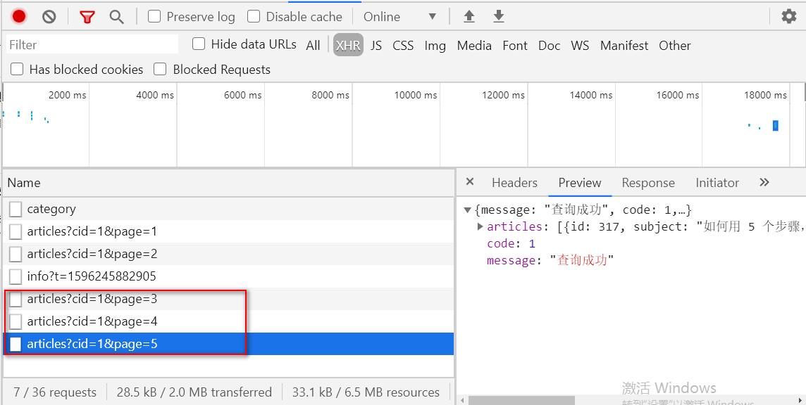

另外，`app.js`中已经获取了当前分类的ID及页码参数，所以无需进行任何修改。但客户端现在还需要接收服务器返回的数据，另外，在接收过程中仍然需要进行图像的动态加载，示例代码如下：

```javascript

loadMore(){
    //页码累加
    this.page++;
    //获取指当前分类下的第几页的数据
    this.axios.get('/articles?cid=' + this.active + '&page=' + this.page).then(res=>{
        let data = res.data.articles;
        data.forEach(item=>{
            if(item.image != null){
                item.image = require('../assets/articles/' + item.image);
            }
            this.articles.push(item);
        });
    });
    }


```

到现在为止，可以在初始情况下获取第一页的数据及滚动情况下获取第N页数据了！

如果进行顶部选项卡切换时，脚手架运行效果如下图所示：

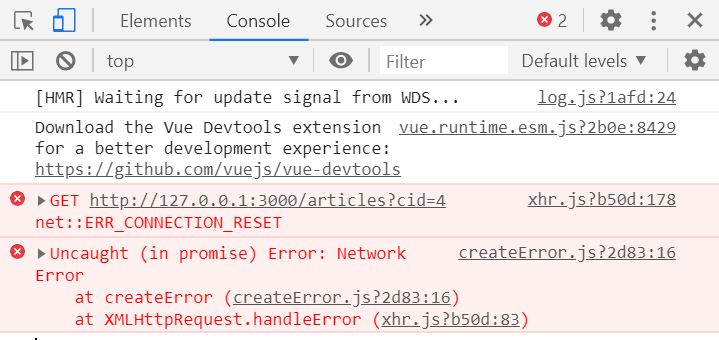

现在服务器提示：连接重置。现在查看一下`HTTP`请求的地址为 `http://127.0.0.1:3000/articles?cid=4`，而原来书写的`/articles` `API` 中需要接收客户端提交的两个参数 -- `cid` 和`page` ，而且现在的请求中只包含一个`cid`！！！接着再推断一下服务器的代码的执行过程：

```javascript

server.get('/articles',(req,res)=>{
	let cid = req.query.cid; //该语句可以正常执行，且值为4
    let page = req.query.page ; //该语句也可以正常执行，且值为undefined
    let offset = (page - 1) * 20 ; // (undefined-1) * 20 ==> NaN
    let sql = 'SELECT * FROM xzqa_article WHERE category_id= ? LIMIT ' + offset + ',20';
    //此时的SQL结构如
    //SELECT * FROM xzqa_article WHERE category_id=4 LIMIT NaN,20;
    //当在执行上述SQL时
    pool.query(sql,.....);
    //上述SQL在MySQL数据库中执行时 LIMIT 中出现了NaN，它认为这是一个变量名称,所以在服务器
    //端出现 undeclared variable : NaN 的错误信息
});


```

所以其根本原因是因为在切换项部选项卡的时候缺少了一个请求参数  -- `page`  

所以需要在`watch()`监听`active`变量时，添加`page`参数即可，示例代码如下：

```javascript


active(){
    //切换顶部选项卡时,清空之前存储的文章数据
    this.articles = [] ;
    this.axios.get('/articles?cid=' + this.active + '&page=' +  this.page).then(res=>{
        let data = res.data.articles;
        data.forEach(item=>{
            if(item.image != null){
                item.image = require('../assets/articles/' + item.image);
            }
            this.articles.push(item);
        });
    });

```

现在虽然可以进行顶部选项卡的切换了，但是在切换后会发现当前选项卡的数据发生了变化，此时查看一下脚手架的控制台可以发现：

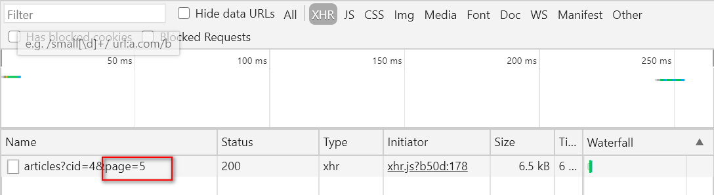

其原因是：因为在`active()`函数中使用`this.page`变量，而这个变量的值可能已经由其他的分类在滚动时动态的发生了变化，所以现在在切换时将带有之前的数据。而切换选项卡时必须要从该分类下的第1页获取数据，所以必须人为将`this.page`变量值改变1即可，示例代码如下：

```javascript

active(){
    //切换顶部选项卡时,清空之前存储的文章数据
    this.articles = [] ;
    //切换顶部选项卡时,页码初始值为1
    this.page = 1;
    this.axios.get('/articles?cid=' + this.active + '&page=' +  this.page).then(res=>{
        let data = res.data.articles;
        data.forEach(item=>{
            if(item.image != null){
                item.image = require('../assets/articles/' + item.image);
            }
            this.articles.push(item);
        });
    });
}

```

因为数据是有限的，但在滚动"最后一页"后继续向下滚动时，仍然可以发送请求，实质是错误的！

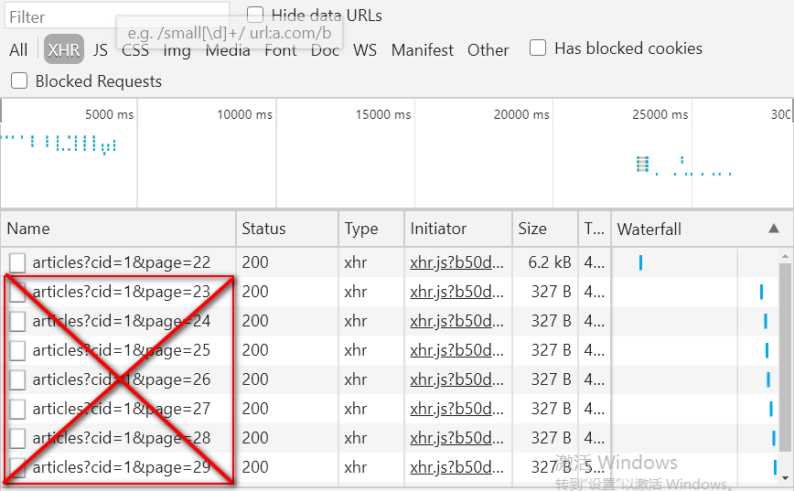

所以在向下滚动时，判断一下当前页码是否超出总页数，如果没有超出，则继续请求，否则不发送请求。所以这有一个根本的问题：如何知道总页数呢?

再想一下，数据是存在于数据库中的，而数据库的访问操作都是在服务器上实现的，所以必须让服务器返回给客户端总页数，然后客户端才能接收该数据，并且利用该数据进行判断操作，以决定是否发送请求。所以现在修改`app.js`

总页数标准计算公式为：

```javascript

Math.ceil(总记录数 / 每页显示的记录数)

```

目前必须要获知到总记录数，才可以计算出总页数 ，`SQL`语句结构如下：

```SQL

SELECT COUNT(id) AS count FROM xzqa_article WHERE category_id=?

```

> `MySQL`中的聚合函数有：`COUNT`、`SUM`、`AVG`、`MIN`、`MAX` ,只有一个返回结果

获取总记录数及总页数的示例代码如下：

```javascript
server.get('/articles',(req,res)=>{
    //获取客户端URL地址栏的参数
    let cid = req.query.cid;
    //获取当前的页码
    let page = req.query.page;
    //分页实质上利用了SELECT语句的LIMIT子句
    //其标准计算公式为 (页码-1) * 每页显示记录数
    //所以现在必须通过上述公式计算出 offset参数值
    let offset = (page-1) * 20;
    //获取总记录数的操作        
    let sql = 'SELECT COUNT(id) AS count FROM xzqa_article WHERE category_id=?';
    pool.query(sql,[cid],(err,result)=>{
        if(err) throw err;
        //获取出总记录数
        //因为聚合函数只有一个返回结果,所以result[0]将返回该结果
        //而结果是一个对象,包含有count的属性(count属性实质是SQL语名中字段的别名)
        let rowCount = result[0].count;
        //声明变量用于存储每页显示的记录数
        let pagesize = 20;
        //声明变量pagecount用于存储计算出来总页数
        let pagecount = Math.ceil(rowCount / pagesize);
    });
});

```

还需要将总页数的结果返回给客户端，除此之外，还要保证两个`SQL`可以都顺序执行到，最后其示代码如下：

```javascript


//获取特定分类下的文章数据
server.get('/articles',(req,res)=>{
    //获取客户端URL地址栏的参数
    let cid = req.query.cid;
    //获取当前的页码
    let page = req.query.page;
    //分页实质上利用了SELECT语句的LIMIT子句
    //其标准计算公式为 (页码-1) * 每页显示记录数
    //所以现在必须通过上述公式计算出 offset参数值
    let offset = (page-1) * 20;
    //获取总记录数的操作        
    let sql = 'SELECT COUNT(id) AS count FROM xzqa_article WHERE category_id=?';
    pool.query(sql,[cid],(err,result)=>{
        if(err) throw err;
        //获取出总记录数
        //因为聚合函数只有一个返回结果,所以result[0]将返回该结果
        //而结果是一个对象,包含有count的属性(count属性实质是SQL语名中字段的别名)
        let rowCount = result[0].count;
        //声明变量用于存储每页显示的记录数
        let pagesize = 20;
        //声明变量pagecount用于存储计算出来总页数
        let pagecount = Math.ceil(rowCount / pagesize);
        //以获取到的参数为条件在文章数据表中进行查找操作    
        sql = 'SELECT id,subject,description,image FROM xzqa_article WHERE category_id = ? LIMIT ' + offset + ',' + pagesize;
        pool.query(sql,[cid],(err,results)=>{
            if(err) throw err;
            res.send({message:'查询成功',code:1,articles:results,pagecount:pagecount});
        });

    });
   
});


```

此时可以在脚手架查看到返回结果中存在总记录的信息，截图如下：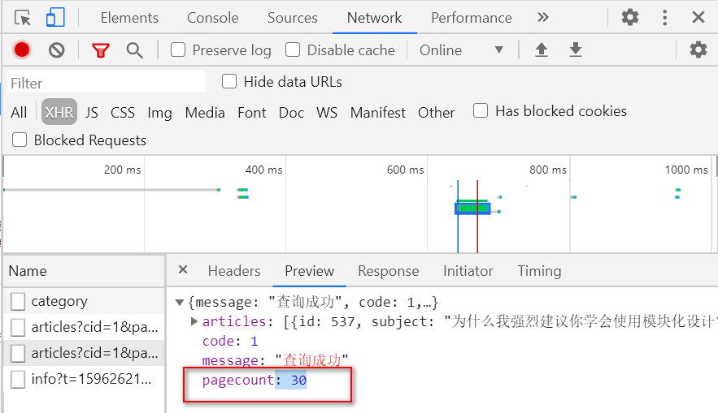

所以现要客户端必须要接收返回数据，故在`data()`中声明`pagecount`属性用于存储该返回结果，示例代码如下：

```javascript

data(){
	return {
        //用于存储服务器返回的总页数
		pagecount:0
	}
}


```

以下代码处都需要接收服务器返回的总页数：

第一：`mounted`钩子函数中 (因为初始化的`pagecount`为`0`,但当`mounted`运行之后，即可获取到服务器的总页数，所以客户端需要接收)

第二：在监听`active`变量的函数中(因为顶部选项卡发生了变化，也就意味着分类发生了变化，同样总页数也可能发生变化)

第三：在`loadMore()`函数中，实际上根本无需在该方法中接收服务器返回的总页数，之所以添加接收语句的原因是 -- 自定义函数的封装

既然已经接收到了总页数的数据，那么就应该在`loadMore()`函数调用时，来判断当前页码与总页数的比较情况，如果在总页数范围内，则继续发送请求，否则无需发送请求。示例代码如下：

```javascript

loadMore(){
	this.page++;
	if(this.page <= this.pagecount){
		//.....
	}
}

```

纵观`mounted()`、`active()`及`loadMore()`函数中，都存在发送异步请求的过程，而且代码完全相同，所以最好的解决方案是：将发送异步请求的过程封装为自定义函数，然后多次调用即可！！！如装`loadData()`的函数，示例代码如下：

```javascript

methods:{
    loadData(){
        //....
    }
}

```

当封装完自定义函数后，需要分别在`mounted()`、`active()`及`loadMore()`函数中进行调用即可。

当触发无限滚动时，如果服务器处理请求的速度非常慢，此时最好：

1.当用户再次进行滚动范围时不再触发滚动指定

​	第一步：在相关无限滚动指定的`HTML`元素上添加 `infinite-scroll-disabled="busy"`属性

​	第二步：在`data`属性变量`busy`，并且指定初始值为`false`

​	第三步：在`loadData()`函数中将`busy`属性设置为`true`,代表当前服务器正在处理相关的请求，既	使现在再次滚动到指定范围内，也不再触发滚动指令。

​	第四步：在`loadData()`函数处理完成之后，应该将`busy`属性修改为`false`，代表现在服务器已经

​	处理完相关请求了，现在可以继续处理其他请求.

2.最好在页面中显示加载提示框，以提示用户

`Indicator`组件

`indicator` 组件用于显示加载提示框，其语法结构是：

```javascript

//打开的简捷语法
this.$indicator.open("提示内容")

//打开的标准语法
this.$indicator.open({
	text:"提示内容",
	spinnerType:"snake|double-bounce|triple-bounce|fading-circle"
})


//关闭的语法
this.$indicator.close()

```

> `snake`，蛇形，`double-bounce`，双弹跳，`triple-bounce`，三弹跳，`fading-circle`，渐消圆

在应用中应该是在发送请求时出现加载提示框，而在请求完毕后，关闭加载提示框！

所以应该在`loadData()`函数调用时出现加载提示框，而该函数执行完成后，关闭加载提示框，示例代码如下：

```javascript

loadData(){
    //代表当前服务器正在处理请求,既使再次进入滚动范围也不再触发滚动指令
    this.busy = true;
    //显示加载提示框
    this.$indicator.open('加载中...');
    this.axios.get('/articles?cid=' + this.active + '&page=' + this.page).then(res=>{
        //获取服务器返回的文章数据
        let data = res.data.articles;
        //将服务器返回的总页数存储到pagecount变量中
        this.pagecount = res.data.pagecount;      
        data.forEach(item=>{
            //因为有的文章不存在缩略图，所以无需动态加载
            if(item.image != null){
                //动态加载缩略图(实际上是动态加载后,属性重新赋值的过程)
                item.image = require('../assets/articles/' + item.image);
            }
            //将item(文章对象,包含id,subject等属性添加到articles数组的未尾)
            this.articles.push(item);                        
        }); 
        //代表服务器已经可以继续处理接下来的滚动指令了
        this.busy = false;
        //关闭加载提示框 
        this.$indicator.close();
    });

```

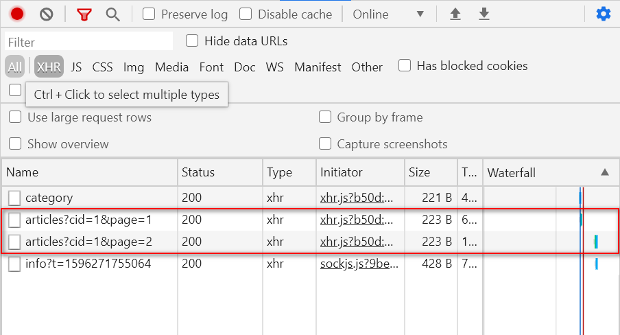


初始浏览时的异步请求如上图所示，发现竟然有两个请求，根本原因是：是因为`Mint UI`将自动触发一次无限滚动的指令。其依靠于`infinite-scroll-immediate-check="true"`属性解决。

## 1.2 文章详情页 

现在在首页中单击文章的标题及缩略图可以链接到文章详情页面，以查看详细信息，所以：

第一步：创建页面组件，并且在`router/index.js`中导入该页面组件，并且设定路由信息

第二步：在首页中分别为文章的标题及缩略图添加链接，以链接到刚刚完成的页面组件

第三步：在文章详细页面中要**显示刚刚单击的那篇文章的详细信息** -- 如何知道刚才单击的是哪一篇文章呢? 只能通过`URL`传参的方式进行传递了，其有两种实现方法：

A.`article?id=5`的形式

B.`article/5`的形式

目前在本案例中准备使用第二种方式

如果要采用第二种方式的话，必须在书写链接时，带有后面的`id`参数(也是就说必须带有`5`、`12`等数字才行)，所以首页中的链接必须进行修改，示例代码如下：

```html

<div class="InfoItemHead">
    <router-link :to="`/article/${article.id}`">
    {{article.subject}}
    </router-link>
</div>


```

此时单击某一篇文章的标题后显示的结果如下图所示:

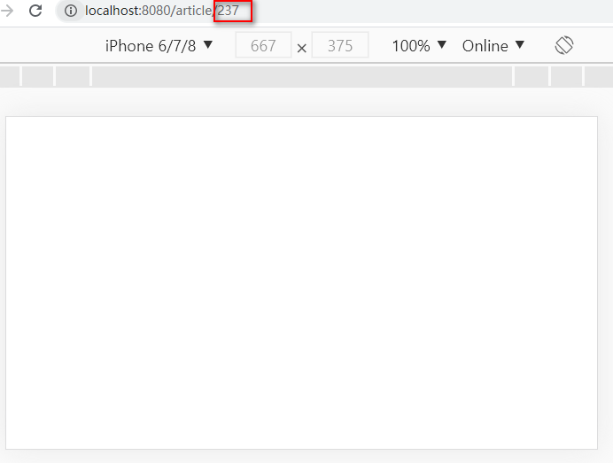

原因是因为：路由信息与当前地址不匹配！！！

所以还需要修改路由信息，代码如下：

```javascript

{
   path:'/article/:id',
   component:Article
}

```

此时可以显示出正常的、预期的结果了，截图如下：

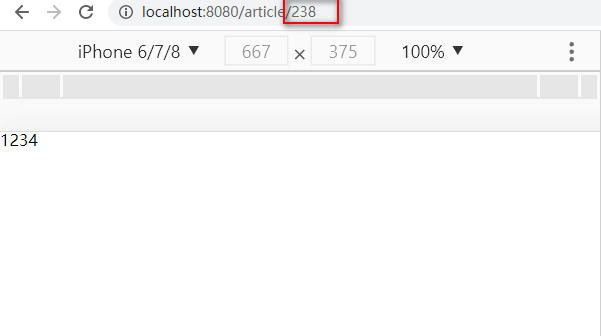

现在需要获取出地址栏中的参数值，并且在`mounted`钩子函数中发送异步请求，去获取该篇文章的详细信息，所以：
第一步：获取地址栏中的参数值

```javascript

this.$route.params.id

```

第二步：在`mounted`钩子函数中发送请求，示例代码如下：

```javascript

mounted(){
	let id = this.$route.params.id;
    this.axios.get('/view?id=' + id).then(res=>{
       //.... 
    });
}

```

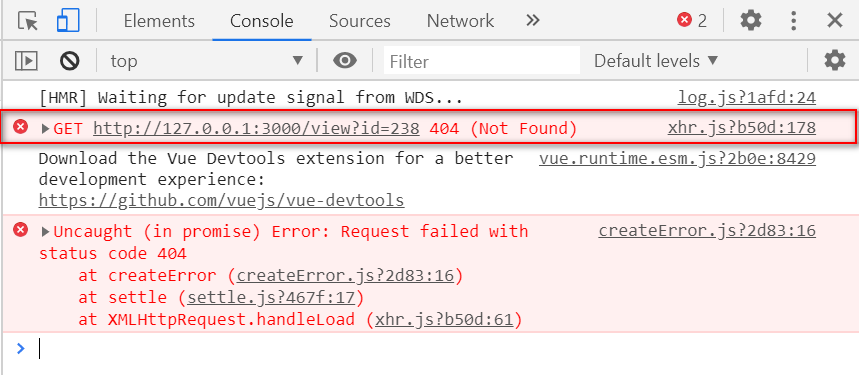

作业：

1.完成显示文章详细信息的功能 -- 文章的详细信息存储到`xzqa_article`数据表中。

2.尝试完成用户的注册操作

