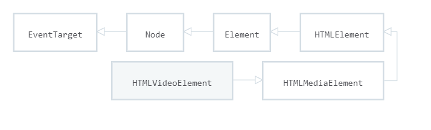
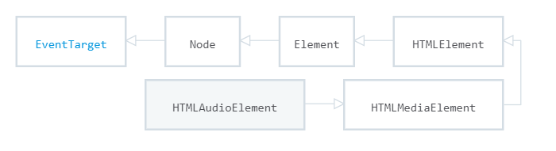

# `HTML5`新特性 -- `Unit01`

# 1.音频与视频的标签

## 1.1 视频格式

浏览器支持的视频格式：`mp4`、`webm`、`ogg`

| 浏览器    | `MP4` | `WEBM` | `OGG` |
| --------- | ----- | ------ | ----- |
| `IE9+`    | `YES` | `NO`   | `No`  |
| `Chrome`  | `YES` | `YES`  | `YES` |
| `Firefox` | `NO`  | `YES`  | `YES` |
| `Safari`  | `YES` | `NO`   | `NO`  |
| `Opera`   | `NO`  | `YES`  | `YES` |

## 1.2 视频标签

### · 简捷语法

```html

<video src="视频文件URL地址" width="宽度" height="高度">
    浏览器不支持视频的提示文本
</video>

```

###  ·  标准语法

```html

<video width="宽度" height="高度">
    <source src="视频文件URL地址"/>
    ...
    浏览器不支持视频的提示文本
</video>

```

## 1.3 视频属性

· `controls`，布尔属性，用于控制是否显示视频播放控件

· `autoplay`，布尔属性，用于控制是否自动播放视频(需与`muted`属性组合使用)

· `muted`，布尔属性，用于控制视频是否静音播放

· `loop`，布尔属性，用于控制视频是否循环播放

· `poster`,海报帧的`URL`

· `preload`,控制视频的预载入方式

​	· `auto`,浏览器尽可能的下载视频文件(播放流畅，但会造成网络流量的浪费)

​	·  `none`，不缓存视频，尽可能的减少流量的浪费

​	· `metadata`,只加载视频的时长、宽度、高度等信息

## 1.4 音频格式

浏览器支持的音频格式：`mp3`、`wav`、`ogg`

| 浏览器    | `MP3` | `WAV` | `OGG` |
| --------- | ----- | ----- | ----- |
| `IE9+`    | `YES` | `NO`  | `No`  |
| `Chrome`  | `YES` | `YES` | `YES` |
| `Firefox` | `NO`  | `YES` | `YES` |
| `Safari`  | `YES` | `YES` | `NO`  |
| `Opera`   | `NO`  | `YES` | `YES` |

## 1.5 音频标签

### ·  简捷语法

```html

<audio src="音频文件URL">
    浏览器不支持音频的提示文本
</audio>    

```

### ·  标准语法

```html

<audio>
    <source src="音频文件URL"/>
    ...
    浏览器不支持音频的提示文本
</audio> 

```

## 1.6 音频属性

· `controls`，布尔属性，用于控制是否显示音频播放控件

· `autoplay`，布尔属性，用于控制是否自动播放音频(需与`muted`属性组合使用)

· `muted`，布尔属性，用于控制音频是否静音播放

· `loop`，布尔属性，用于控制音频是否循环播放

· `preload`,控制音频的预载入方式

​	· `auto`,浏览器尽可能的下载音频文件(播放流畅，但会造成网络流量的浪费)

​	·  `none`，不缓存音频，尽可能的减少流量的浪费

​	· `metadata`,只加载音频的时长信息

# 2.`JavaScript`与音频和视频

## 2.1 `HTMLVideoElement`

`HTMLVideoElement` 接口提供用于操作视频对象的属性和方法，该接口继承自`HTMLMediaElement`和`HTMLElement`。



·  `width`属性

`width`属性用于获取/设置视频对象的宽度，语法结构是：

```javascript

//获取
variable = HTMLVideoElement.width

//设置
HTMLVideoElement.width = value

```

> 获取视频元素的`width`属性时必须保证`HTML` `<video>`标签中存在`width`属性

· `height`属性

`height`属性用于获取/设置视频对象的高度，语法结构是：

```javascript

//获取
variable = HTMLVideoElement.height

//设置
HTMLVideoElement.height = value

```

> 获取视频元素的`height`属性时必须保证`HTML` `<video>`标签中存在`height`属性

· `videoWidth`属性

`videoWidth`属性用于获取视频对象原始宽度，语法结构是：

```javascript

variable = HTMLVideoElement.videoWidth

```

· `videoHeight`属性

`videoHeight`属性用于获取视频对象原始高度，语法结构是：

```javascript

variable = HTMLVideoElement.videoHeight

```

> 如果要获取视频对象的原始宽度和高度必须在`loadeddata`事件完成后才能使用，其示例代码如下：
>
> ```html
> 
> <script>
>     //获取HTMLVideoElement对象
>     let videoEle = document.getElementById('video');
>     //loadeddata事件代表是已经加载完成视频的第一帧
>     //如果已经加载了视频的第一帧的话，那么原始宽度和高度肯定已经
>     //能够进行访问了
>     videoEle.addEventListener('loadeddata',()=>{
>         //输出视频的原始宽度和高度
>         console.log(videoEle.videoWidth);
>         console.log(videoEle.videoHeight);
>     });
> </script>
> 
> ```

· `poster`属性

`poster`属性用于获取/设置视频的海报帧，其语法结构是：

```javascript

//获取
varible = HTMLVideoElement.poster

//设置
 HTMLVideoElement.poster = value

```

## 2.2 `HTMLAudioElement`

`HTMLAudioElement` 接口提供用于操作音频对象的属性和方法，该接口继承自`HTMLMediaElement`和`HTMLElement`。



· 构造函数

```javascript

variable = new Audio([音频文件的URL地址])

```

## 2.3 `HTMLMediaElement`  

`HTMLMediaElement`接口提供用户操作媒体(音频和视频)的属性和方法。

### 2.3.1 属性

· `autoplay` 

`autoplay`属性用于获取/设置媒体对象是否自动播放，其语法结构是:

```javascript

//获取
variable = HTMLMediaElement.autoplay

//设置
HTMLMediaElement.autoplay = boolean 

```

· `muted`

`muted`属性用于获取/设置媒体对象在播放时是否静音，其语法结构是：

```javascript

//获取
variable = HTMLMediaElement.muted

//设置
HTMLMediaElement.muted = boolean 

```

· `controls`

`controls`属性用于获取/设置媒体对象在播放时是否显示播放控件，其语法结构是：

```javascript

//获取
variable = HTMLMediaElement.controls

//设置
HTMLMediaElement.controls = boolean 

```

· `loop`

`loop`属性用于获取/设置媒体对象是否循环播放，其语法结构是：

```javascript

//获取
variable = HTMLMediaElement.loop

//设置
HTMLMediaElement.loop = boolean 

```

· `src`

`src`属性用于获取/设置媒体文件的URL地址，其语法结构是：

```javascript

//获取
variable = HTMLMediaElement.src

//设置
HTMLMediaElement.src = 媒体文件的URL地址

```

· `volume`

`volume`属性用于获取/设置媒体的音量(取值范围来`[0,1]`)，其语法结构是：

```javascript

//获取
varaible = HTMLMediaElement.volume

//设置
HTMLMediaElement.volume = 值

```

· `playbackRate`

`playbackRate`属性用于获取/设置媒体的播放速率，如果其值为`1.0`，为正常速率，如果小于`1.0`则低于正常速率，否则高于正常速率。

```javascript

//获取
varaible = HTMLMediaElement.playbackRate

//设置
HTMLMediaElement.playbackRate = 值

```

· `paused`

`paused`属性用于获取媒体对象是否在暂停，语法结构是：

```javascript

variable = HTMLMediaElement.paused

```

· `ended`

`ended`属性用于获取媒体对象是否播放完毕，语法结构是：

```javascript

variable = HTMLMediaElement.ended

```

· `currentTime`

`currentTime`属性用于获取/设置媒体对象的当前播放时间(单位为秒)，其语法结构是：

```javascript

//获取
varaible = HTMLMediaElement.currentTime

//设置
HTMLMediaElement.currentTime = 值

```

· `duration`

`duration`属性用于获取媒体对象的总时长(单位为秒)，其语法结构是：

```javascript

//获取
varaible = HTMLMediaElement.duration

```

### 2.3.2 方法

· `play()`

`play()`方法用于实现媒体的播放，其语法结构是：

```javascript

HTMLMediaElement.play()

```

· `pause()`

`pause()`方法用于实现媒体的暂停，其语法结构是：

```javascript

HTMLMediaElement.pause()

```

### 2.3.3 事件

· `play`

`play`事件在媒体对象播放时触发，其语法结构是：

```javascript

HTMLMediaElement.addEventListener('play',()=>{
	...
})

HTMLMediaElement.onplay = ()=>{
    ....
}

```

· `pause`

`pause`事件在媒体对象暂停时触发，其语法结构是：

```javascript

HTMLMediaElement.addEventListener('pause',()=>{
	...
})

HTMLMediaElement.onpause = ()=>{
    ....
}

```

· `ended`

`ended`事件在媒体对象播放完毕后触发，其语法结构是：

```javascript

HTMLMediaElement.addEventListener('ended',()=>{
	...
})

HTMLMediaElement.onended = ()=>{
    ....
}

```

· `loadeddata`

`loadeddata`事件在媒体文件的第一帧加载完成后被触发，其语法结构是：

```

HTMLMediaElement.addEventListener('loadeddata',()=>{
	...
})

HTMLMediaElement.onloadeddata = ()=>{
    ....
}


```

· `timeupdate`

`timeupdate`事件在媒体对象的`currentTime`属性发生变化时调用，其语法结构是：

```javascript

HTMLMediaElement.addEventListener('timeupdate',()=>{
	...
})

HTMLMediaElement.ontimeupdate = ()=>{
    ....
}

```

作业：

自定义视频播放器：

A.单击播放/暂停时实现播放/暂停(图标需要变化)

B.音击喇叭可实现静音与非静音的切换(图标需要变化)

C.在拖动音时滑块时控制音量的变化（提醒：如果拖动到最左侧时，要显示静音的图标）

D.将当前时长与总时长转换为分分:秒秒的形态,如`00:33`