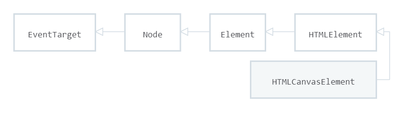

# `HTML5`新特性 -- `Unit02`

# 1.全屏模式

全屏模式可以让一个`Element`及其子元素占满整个屏幕。

· 进入全屏模式

```javascript

//W3C的建议
Element.requestFullscreen()
//Chrome、safari
Element.webkitRequestFullscreen()
//Firefox
Element.mozRequestFullScreen()
//Internet Explorer
Eelement.msRequestFullscreen()

```

· 退出全屏模式

```javascript

//W3C的建议
document.exitFullscreen()
//Chrome、safari
document.webkitExitFullscreen()
//Firefox
document.mozCancelFullScreen()
//Internet Explorer
document.msExitFullscreen()

```

· 获取全屏元素

```javascript

//W3C的建议
document.fullscreenElement


```

# 2.`Canvas`

`canvas`是通过`JavaScript`来绘制图形的`HTML`元素，其语法结构是：

```html

<canvas width="宽度" height="高度"></canvas>

```

## 2.1 `HTMLCanvasElement`

`HTMLCanvasElement`接口提供处理`<canvas>`元素的属性和方法。该接口继承自`HTMLElement`接口。



· `width`属性

`width`属性用于获取/设置`<canvas>`元素的宽度，其语法结构是：

```javascript

//获取
variable = HTMLCanvasElement.width

//设置
HTMLCanvasElement.width = value

```

· `height`属性

`height`属性用于获取/设置`<canvas>`元素的高度，其语法结构是：

```javascript

//获取
variable = HTMLCanvasElement.height

//设置
HTMLCanvasElement.height = value

```

· `getContext()`方法

`getContext()`方法用于获取`<canvas>`元素的上下文，如果没有定义上下文则返回`null`，其语法结构是：

```javascript

HTMLCanvasElement.getContext(contextType)

```

> `contextType`参数值可以为：
> `2d`，将返回`CanvasRenderingContext2D`对象，二维上下文渲染对象
>
> `webgl`,将返回`WebGLRenderingContext`对象，三维上下文渲染对象

# 3.`CanvasRenderingContext2D`对象

> `<canvas>`元素的坐标原点`(0,0)`位画布的左上角
>
> **笔记中用`ctx`代表`CanvasRenderingContext2D`对象**

· `strokeRect()`方法

`strokeRect()`方法用于绘制描边矩形，其语法结构是：

```javascript

ctx.strokeRect(x,y,width,height)

```

· `fillRect()`方法

`fillRect()`方法用于绘制填充矩形，其语法结构是：

```javascript

ctx.fillRect(x,y,width,height)

```

· `strokeStyle`属性

`strokeStyle`属性用于获取/设置描边颜色，其语法结构是：

```javascript

//获取
variable = ctx.strokeStyle

//设置
ctx.strokeStyle = color

```

> 颜色的写法参照`CSS`样式中颜色的写法

· `fillStyle`属性

`fillStyle`属性用于获取/设置填充颜色，其语法结构是：

```javascript

//获取
variable = ctx.fillStyle

//设置
ctx.fillStyle = color

```

· `strokeText()`方法

`strokeText()`方法用于绘制描边文本，其语法结构是：

```

ctx.strokeText(text,x,y)

```

· `fillText()`方法

`fillText()`方法用于绘制填充文本，其语法结构是：

```

ctx.fillText(text,x,y)

```

·  `font` 属性

`font`属性用于获取/设置文本样式，其语法结构是：

```javascript

//获取
variable = ctx.font
//设置
ctx.font = "字号 字体"

```

