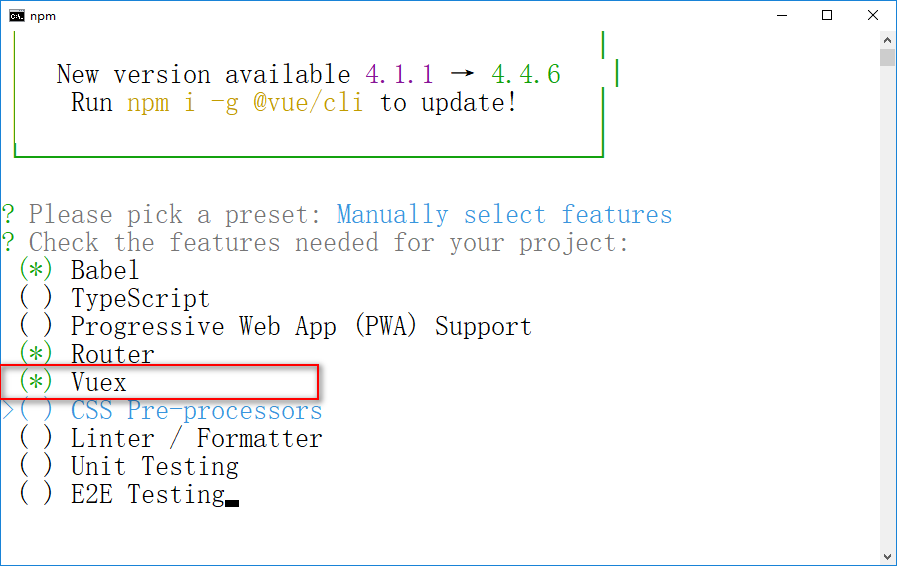

# `HTML5`新特性 -- `Unit04`

# 1.`Vuex`

## 1.1 什么是`Vuex?`

`Vuex`是一个专门为`Vue`应用程序开发的状态管理模式，它采用集中式的管理方式来管理`Vue`组件中共享的状态（数据）。

`Vuex`的应用场景：

· 用户登录的状态

· 购物车的状态等

## 1.2 安装`Vuex`

方式1：在通过`vue create`命令创建脚手架项目时，选择`Vuex`插件



方式2：通过`npm`进行安装

```shell

npm install --save vuex

```

> `Vuex`本质就是`Vue`的一个插件
>
> `Vuex`建议存储到`store`目录下的`index.js`中

## 1.3 基本用法

`Vuex`的核心是`Store`，其就是一个容器，包含了`Vue`应用中的状态。其基本结构是：

```javascript

export default new Vuex.Store({
    state: {
    },
    mutations: {
    },
    actions: {
    },
    modules: {
    }
})

```

### · `state`

`state`定义了应用状态的数据结构，其数据类型可以为`string`、`number`、`boolean`、`array`、`object`等。示例代码如下：

```javascript

state: {
    username:'Tom',
    age:23,
    sex:true,
    products:[
        {
            id:1,
            productName:'商品1',
            salePrice:2389.99
        },
        {
            id:3,
            productName:'商品2',
            salePrice:6999.99
        }
    ]
}

```

### · `Vue`组件访问`Vuex`中的状态

```javascript

this.$store.state.xxx

```

示例代码如下：

```html

<template>
    <div>
        <h1>访问Vuex的数据--页面1</h1>
        <p>姓名:{{$store.state.username}}</p>
        <p>年龄:{{$store.state.age}}</p>
        <p>性别:{{$store.state.sex ? '男' : '女'}}</p>
    </div>
</template>
<script>
    export default {
        mounted(){
            console.log(this.$store.state.age);
        }
    }
</script>


```

### · `getters`

`Vuex`允许在`store`中定义`getter`(可以认为是`store`的计算属性)，`getter`的返回值会自动缓存，只有其依赖的值发生了变化才会被重新计算，其语法结构是：

```javascript

getters:{
    //获取商品的数量 -- 这些方法被认为是state的计算属性
    //state参数自动代表当前store的state(其实名称可以为任意合法名称)
    productNum(state){
    	return state.products.length;
    }
},

```

```html

<h2>商品列表中有{{this.$store.getters.productNum}}件,具体如下:</h2>


```

### · `mutations`

`mutations`是用于改变状态的方法，也是唯 一修改`state`的推荐方法，示例代码如下：

```


```

## ·  在页面组件中调用`mutations`中的方法

```javascript

this.$store.commit('方法名称',[payload])

```

# 2.`WebStorage`

分类`sessionStorage`和`localStorage`两种存储机制。

`length`属性

`setItem()`方法

`getItem()`方法

`removeItem()`方法

`clear()`方法

