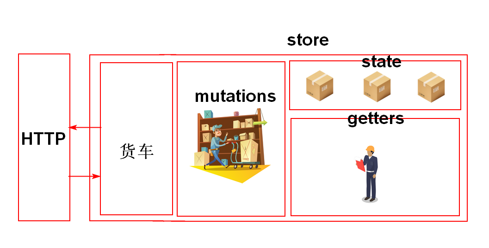
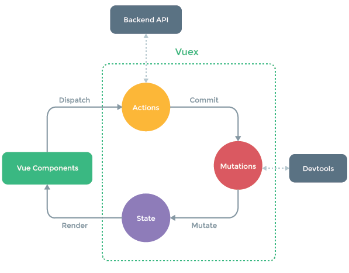

# `HTML5`新特性 -- `Unit05`

# 1.`Vuex`

`Vuex`的核心是`Store`，其就是一个容器，包含了`Vue`应用中的状态。其基本结构是：

```javascript

export default new Vuex.Store({
    state: {
    },
    getters:{        
    },
    mutations: {
    },
    actions: {
    },
    modules: {
    }
})


```

## · `Actions`

`Actions`用于异步发送请求，示例代码如下：

```javascript

actions: {
    get_data_action(){
        axios.get('http://127.0.0.1:3000/data').then(res=>{

        });
    }
}

```

## · 调用`Actions`的方法

```javascript

this.$store.dispatch("方法名称"[,payload])

```





# 2.`WebStorage`

`Webstorage`提供了一种比`cookie`更加直观的数据存储方式，其以名/值对的形式进行存储。其分为两种存储机制：

`sessionStorage`,仅在浏览器窗口打开期间有效。

`localStorage`,其永远有效。

`sessionStorage`和`localStorage`有相同的属性和方法

· `length`属性

`length`属性用于获取项目的数量，其语法结构是：

```javascript

sessionStorage.length

localStorage.length

```

· `setItem()`方法

`setItem()`方法用于设置存储项目，其语法结构是：

```javascript

sessionStorage.setItem(key,value)

localStorage.setItem(key,value)

```

· `getItem()`方法

`getItem()`用于获取项目的值，其语法结构是：

```javascript

variable = sessionStorage.getItem(key)

variable = localStorage.getItem(key)

```

· `removeItem()`方法

`removeItem()`方法用于删除项目，其语法结构是：

```javascript

sessionStorage.removeItem(key)

localStorage.removeItem(key)

```

· `clear()`方法

`clear()`方法用于删除所有项目，其语法结构是：

```javascript

sessionStorage.clear()
localStorage.clear()

```

# 3.拖放

拖放即将源对象从一个位置拖动到另一个位置，在`HTML5` 中任何元素都可以实现拖放，但为保证浏览器的兼容性，建议为被拖放的对象添加`draggable="true"`属性。

## 3.1 拖放事件

### · `dragstart`事件

`dragstart`事件在源对象开始被拖放时触发，其语法结构是：

```javascript

HTMLElement.addEventListener('dragstart',()=>{
	//...
});

HTMLElement.ondragstart = ()=>{
	//...
}

```

### · `drag`事件

`drag`事件在源对象拖放过程中被触发，其语法结构是：

```javascript

HTMLElement.addEventListener('drag',()=>{
	//...
});

HTMLElement.ondrag = ()=>{
	//...
}

```

### · `dragend`事件

`dragend`事件在源对象释放后被触发(也可能在目标区域内，也可能在目标区域外)，其语法结构是：

```javascript

HTMLElement.addEventListener('dragend',()=>{
	//...
});

HTMLElement.ondragend = ()=>{
	//...
}


```


------

### ·  `dragenter`事件

`dragenter`事件是在源对象进入目标对象的区域范围时被触发，其语法结构是：

```javascript


HTMLElement.addEventListener('dragenter',()=>{
	//...
});

HTMLElement.ondragenter = ()=>{
	//...
}

```

### ·  `dragover`事件

`dragover`事件在源对象在目标对象悬停时触发，其语法结构是：

```javascript

HTMLElement.addEventListener('dragover',(event)=>{
    event.preventDefault();
	//...
});

HTMLElement.ondragover = (event)=>{
    event.preventDefault();
	//...
}

```

> 必须在该事件内调用`event.preventDefault()`方法，否则不会触发`drop`事件

### ·  `dragleave`事件

`dragleave`事件在源对象拖动离开目标对象时触发，其语法结构是：

```javascript

HTMLElement.addEventListener('dragleave',()=>{
	//...
});

HTMLElement.ondragleave = ()=>{
	//...
}

```

### ·  `drop`事件

`drop`事件将在源对象在目标对象范围内释放时触发，其语法结构是：

```javascript


HTMLElement.addEventListener('drop',()=>{
	//...
});

HTMLElement.ondrop = ()=>{
	//...
}

```

拖放事件的触发顺序：

`dragstart` --> `drag` --> `dragenter`-->`dragover`--> `drop`-->`dragend`

### 3.2 `dataTransfer`属性

拖放事件的`dataTransfer`属性将返回`DataTransfer` 对象，用于保存拖放数据，其语法结构是：

```javascript

DataTransfer DragEvent.dataTransfer

```

> `DragEvent`代表拖放事件对象

## 3.3 `DataTransfer`对象

### · `setData()`方法

`setData()`方法用于给指定的类型设置数据，如果类型不存在则自动添加到到未尾，如果存在的话，则替换原来的值，其语法结构是：

```javascript

DataTransfer.setData(type,value)

```

### ·  `getData()`方法

`getData()`方法用于获取指定类型的数据，其语法结构是：

```javascript

variable = DataTransfer.getData(type)

```

